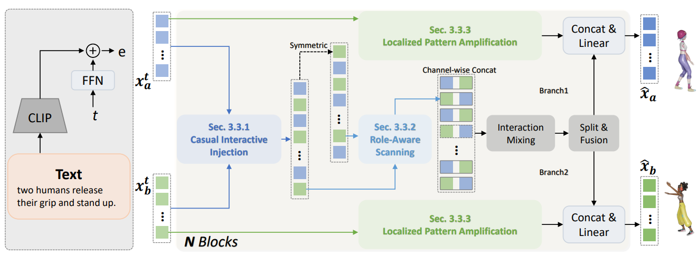

<div align="center">
  <h1>TIMotion</h1>
  
  <h3>[CVPR 2025] TIMotion: Temporal and Interactive Framework for Efficient Human-Human Motion Generation </h3>
  
  <a href='https://aigc-explorer.github.io/TIMotion-page/'></a> <a href='https://arxiv.org/abs/2408.17135'></a> 
  
   
   
</div>

## Introduction
This repository is an implementation of [TIMotion(CVPR 2025)](https://arxiv.org/abs/2408.17135). If you find this project helpful, please cite our paper ([BibTeX](#bib_cit)). Thank you.


## Getting started

### 1. Setup environment

```shell
conda create --name timotion
conda activate timotion
pip install -r requirements.txt
```

### 2. Data Preparation


Download the data from [webpage](https://tr3e.github.io/intergen-page/). And put them into ./data/.

#### Data Structure
```sh
<DATA-DIR>
./annots                //Natural language annotations where each file consisting of three sentences.
./motions               //Raw motion data standardized as SMPL which is similiar to AMASS.
./motions_processed     //Processed motion data with joint positions and rotations (6D representation) of SMPL 22 joints kinematic structure.
./split                 //Train-val-test split.
```


### 3. Pretrained Models

Prepare the evaluation model

```shell
bash prepare/download_evaluation_model.sh
```

Download the checkpoints of [TIMotion](https://drive.google.com/file/d/15WE1kiITcrwva3QTGW86plgxA8zmufq4/view?usp=sharing) and [TIMotion w.o LPA](https://drive.google.com/file/d/1c_yqF1gtXUapgX7spt52bXSFKVdhbpDD/view?usp=sharing)


## Train (8 GPUs)


Modify config files ./configs/model.yaml ./configs/datasets.yaml and ./configs/train.yaml, and then run:

```shell
python tools/train.py --LPA
```

Or you can train TIMotion without LPA as:

```shell
python tools/train.py --epoch 1500
```


## Evaluation


Modify config files ./configs/model.yaml and ./configs/datasets.yaml

```shell
python tools/eval.py --LPA --pth ${CHECKPOINT}
```


## Citation

If you find our work useful in your research, please consider citing:
<a id="bib_cit"></a>

```
@inproceedings{wang2025TIMotion,
      title={TIMotion: Temporal and Interactive Framework for Efficient Human-Human Motion Generation}, 
      author={Yabiao Wang and Shuo Wang and Jiangning Zhang and Ke Fan and Jiafu Wu and Zhucun Xue and Yong Liu},
      booktitle={Proceedings of the IEEE/CVF Conference on Computer Vision and Pattern Recognition (CVPR)},
      year={2025}
```

